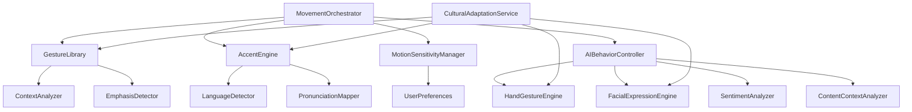

# Design Document

## Overview

The Avatar Movement Enhancement system transforms the current random movement patterns into a sophisticated, context-aware animation system. The design introduces deliberate movement patterns, language-specific accent adaptation, and gesture coordination to create natural, engaging avatar interactions.

## Architecture

### Core Components

1. **MovementOrchestrator**: Central coordinator for all avatar movements
2. **AccentEngine**: Handles language-specific pronunciation and speech patterns
3. **GestureLibrary**: Repository of contextual gestures and movements
4. **AIBehaviorController**: Real-time content analysis and behavior determination
5. **HandGestureEngine**: Manages hand movements and arm positioning
6. **FacialExpressionEngine**: Controls contextual facial expressions
7. **MotionSensitivityManager**: Manages accessibility and user preferences
8. **CulturalAdaptationService**: Provides culture-specific movement patterns

### Component Interactions



## Components and Interfaces

### MovementOrchestrator

**Purpose**: Coordinates all avatar movements and ensures smooth transitions between different animation states.

**Key Methods**:
- `orchestrateMovement(speechContent: string, language: string, context: MovementContext): MovementPlan`
- `transitionToIdle(): void`
- `emphasizeContent(emphasis: EmphasisData): void`
- `applyMotionSettings(settings: MotionSettings): void`

**Interfaces**:
```typescript
interface MovementPlan {
    headMovements: HeadMovement[];
    gestures: Gesture[];
    transitions: Transition[];
    duration: number;
}

interface MovementContext {
    isQuestion: boolean;
    isExplanation: boolean;
    emphasisLevel: 'low' | 'medium' | 'high';
    culturalContext: string;
}
```

### AccentEngine

**Purpose**: Adapts speech patterns, timing, and pronunciation based on the selected language.

**Key Methods**:
- `adaptAccent(text: string, language: string): AccentedSpeechData`
- `getPronunciationRules(language: string): PronunciationRules`
- `adjustSpeechTiming(phonemes: PhonemeData[], language: string): PhonemeData[]`

**Interfaces**:
```typescript
interface AccentedSpeechData {
    modifiedPhonemes: PhonemeData[];
    speechTiming: TimingData;
    accentMarkers: AccentMarker[];
}

interface PronunciationRules {
    vowelMappings: Record<string, string>;
    consonantMappings: Record<string, string>;
    rhythmPattern: RhythmPattern;
    stressPatterns: StressPattern[];
}
```

### GestureLibrary

**Purpose**: Provides contextually appropriate gestures and movement patterns.

**Key Methods**:
- `getGestureForContext(context: MovementContext): Gesture[]`
- `getEmphasisGesture(emphasisType: string): Gesture`
- `getIdleMovements(intensity: number): IdleMovement[]`

**Interfaces**:
```typescript
interface Gesture {
    type: 'head_nod' | 'head_tilt' | 'eyebrow_raise' | 'hand_gesture';
    intensity: number;
    duration: number;
    timing: number;
    culturalVariant?: string;
}

interface IdleMovement {
    type: 'breathing' | 'micro_movement' | 'blink_pattern';
    amplitude: number;
    frequency: number;
}
```

### AIBehaviorController

**Purpose**: Analyzes speech content in real-time and determines appropriate gestures, expressions, and behaviors.

**Key Methods**:
- `analyzeContent(text: string, context: SpeechContext): BehaviorPlan`
- `detectSentiment(text: string): SentimentData`
- `identifyEmotionalContext(text: string): EmotionalContext`
- `generateBehaviorResponse(analysis: ContentAnalysis): BehaviorResponse`

**Interfaces**:
```typescript
interface BehaviorPlan {
    handGestures: HandGesture[];
    facialExpressions: FacialExpression[];
    headMovements: HeadMovement[];
    emotionalTone: EmotionalTone;
    priority: 'low' | 'medium' | 'high';
}

interface ContentAnalysis {
    sentiment: 'positive' | 'negative' | 'neutral';
    emotionalIntensity: number;
    contentType: 'question' | 'explanation' | 'celebration' | 'instruction';
    keyPhrases: string[];
    culturalContext: string;
}
```

### HandGestureEngine

**Purpose**: Manages hand movements, arm positioning, and gesture coordination.

**Key Methods**:
- `executeHandGesture(gesture: HandGesture): void`
- `getDescriptiveGesture(content: string): HandGesture`
- `getCelebratoryGesture(intensity: number): HandGesture`
- `getPointingGesture(direction: Direction): HandGesture`

**Interfaces**:
```typescript
interface HandGesture {
    type: 'pointing' | 'counting' | 'descriptive' | 'celebratory' | 'supportive';
    leftHand: HandPosition;
    rightHand: HandPosition;
    duration: number;
    intensity: number;
    synchronizeWithSpeech: boolean;
}

interface HandPosition {
    x: number;
    y: number;
    z: number;
    rotation: Quaternion;
    fingerPositions: FingerPosition[];
}
```

### FacialExpressionEngine

**Purpose**: Controls contextual facial expressions and emotional display.

**Key Methods**:
- `applyExpression(expression: FacialExpression): void`
- `getEmotionalExpression(emotion: EmotionalContext): FacialExpression`
- `blendExpressions(expressions: FacialExpression[]): FacialExpression`
- `transitionToExpression(target: FacialExpression, duration: number): void`

**Interfaces**:
```typescript
interface FacialExpression {
    type: 'smile' | 'concern' | 'excitement' | 'focus' | 'surprise' | 'neutral';
    intensity: number;
    duration: number;
    morphTargets: Record<string, number>;
    eyeMovements: EyeMovement;
    eyebrowPosition: EyebrowPosition;
}

interface EmotionalContext {
    primary: 'joy' | 'concern' | 'excitement' | 'focus' | 'surprise' | 'neutral';
    secondary?: string;
    intensity: number;
    culturalModifier: number;
}
```

## Data Models

### Movement State Management

```typescript
interface AvatarMovementState {
    currentMovement: MovementPlan | null;
    isTransitioning: boolean;
    motionSettings: MotionSettings;
    culturalProfile: CulturalProfile;
    accentProfile: AccentProfile;
}

interface MotionSettings {
    intensity: 'minimal' | 'reduced' | 'standard' | 'enhanced';
    enableGestures: boolean;
    enableHeadMovements: boolean;
    motionSensitivity: boolean;
}
```

### Language and Cultural Profiles

```typescript
interface AccentProfile {
    language: string;
    region?: string;
    pronunciationRules: PronunciationRules;
    speechRhythm: RhythmPattern;
    intonationPatterns: IntonationPattern[];
}

interface CulturalProfile {
    gesturePreferences: GesturePreference[];
    movementAmplitude: number;
    eyeContactPatterns: EyeContactPattern;
    personalSpaceBehavior: PersonalSpaceBehavior;
}
```

## Error Handling

### Movement System Errors

1. **Gesture Conflict Resolution**: When multiple gestures are requested simultaneously
   - Priority system based on context importance
   - Smooth blending of compatible gestures
   - Graceful degradation to simpler movements

2. **Accent Loading Failures**: When language-specific accent data is unavailable
   - Fallback to neutral pronunciation
   - Gradual loading of accent data in background
   - User notification of limited accent support

3. **Motion Sensitivity Conflicts**: When user preferences conflict with content requirements
   - User preferences take priority
   - Alternative communication methods (text emphasis, color changes)
   - Configurable override options for critical content

### Performance Considerations

1. **Movement Calculation Optimization**:
   - Pre-calculated gesture libraries
   - Efficient transition algorithms
   - Memory pooling for movement objects

2. **Accent Processing Efficiency**:
   - Cached pronunciation rules
   - Lazy loading of language-specific data
   - Optimized phoneme transformation algorithms

## Testing Strategy

### Unit Testing

1. **MovementOrchestrator Tests**:
   - Gesture selection accuracy
   - Transition smoothness validation
   - Context interpretation correctness

2. **AccentEngine Tests**:
   - Pronunciation rule application
   - Language detection accuracy
   - Speech timing modifications

3. **GestureLibrary Tests**:
   - Contextual gesture retrieval
   - Cultural variant selection
   - Gesture conflict resolution

### Integration Testing

1. **End-to-End Movement Flow**:
   - Speech content → Movement plan → Avatar animation
   - Language change → Accent adaptation → Visual feedback
   - User preference changes → Immediate system response

2. **Cross-Component Communication**:
   - MovementOrchestrator ↔ AccentEngine coordination
   - GestureLibrary ↔ CulturalAdaptationService integration
   - MotionSensitivityManager ↔ User interface synchronization

### Performance Testing

1. **Real-time Movement Generation**:
   - Movement calculation latency < 50ms
   - Smooth 60fps animation rendering
   - Memory usage optimization

2. **Language Switching Performance**:
   - Accent adaptation time < 200ms
   - Seamless transition between languages
   - Resource cleanup efficiency

### Accessibility Testing

1. **Motion Sensitivity Compliance**:
   - Reduced motion mode functionality
   - Vestibular disorder considerations
   - User control effectiveness

2. **Cultural Sensitivity Validation**:
   - Appropriate gesture selection
   - Cultural context accuracy
   - Offensive gesture avoidance

## Implementation Phases

### Phase 1: Core Movement System
- Implement MovementOrchestrator
- Create basic GestureLibrary
- Establish smooth transition system

### Phase 2: Accent Engine Integration
- Develop AccentEngine with basic language support
- Integrate with existing lip-sync system
- Add pronunciation rule processing

### Phase 3: Cultural and Accessibility Features
- Implement CulturalAdaptationService
- Add MotionSensitivityManager
- Create user preference interface

### Phase 4: Advanced Features and Optimization
- Add context-aware gesture selection
- Implement advanced accent variations
- Performance optimization and testing