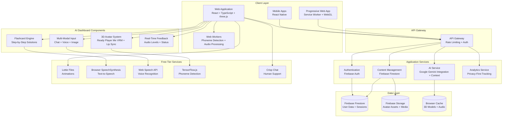

# Design Document

## Overview

This design document outlines the architecture for a senior-focused AI dashboard that prioritizes simplicity, accessibility, and warmth. The platform combines AI-powered assistance with real-time 3D avatars, multi-modal input processing (chat, voice, image), and flashcard-based solution delivery. The design emphasizes visual appeal through subtle animations and interactive AI features while maintaining fast performance on low-end devices and remaining completely free for end users.

The platform will be built using React with TypeScript, Tailwind CSS for styling, three.js for 3D avatar rendering, TensorFlow.js for phoneme detection, and Firebase for backend services. The architecture supports both web and mobile applications with offline capabilities, comprehensive internationalization, and efficient Web Worker processing for performance-critical features.

## Glossary

**Caregiver**: A family member, friend, or professional who assists a senior user with their learning journey and may have limited access to their account with explicit permission.

**Fallback**: Alternative functionality or content that activates when primary systems fail, ensuring continuous user experience.

**Reduced Motion**: Accessibility preference that minimizes or eliminates animations and transitions for users with vestibular disorders or motion sensitivity.

**RTL (Right-to-Left)**: Text direction and layout orientation used in languages like Arabic and Hebrew, requiring mirrored UI layouts.

**Progressive Disclosure**: UX pattern that presents information gradually to avoid overwhelming users, especially important for senior users.

**Escalation**: Automatic or manual process of transferring user support from AI to human assistance when needed.

**Design Tokens**: Centralized design values (colors, spacing, typography) that ensure consistency across the platform and enable easy theming.

## Architecture

### High-Level System Architecture



### Component Architecture

The application follows a modular component architecture with clear separation of concerns:

- **Presentation Layer**: React components with Tailwind CSS styling and accessibility hooks (react-aria, headlessui)
- **State Management**: React Context for global state, React Query/SWR for server state caching and offline support
- **Service Layer**: Abstracted services for AI, authentication, content management
- **Data Layer**: Firebase integration with offline-first approach

### API Gateway Security

The API Gateway implements multiple security layers:
- **JWT Validation**: All authenticated requests validated with Firebase Auth tokens
- **Rate Limiting**: Per-user and per-IP rate limiting to prevent abuse
- **Request Sanitization**: Input validation and sanitization for all endpoints
- **CORS Configuration**: Strict cross-origin resource sharing policies

## Components and Interfaces

### Core Components

#### 1. Landing Page with Animations

**LandingPage Component**
- Integrates DotLottieReact for hero animation
- Implements scroll-triggered swirl animations for feature cards
- Responsive design with mobile-first approach
- Accessibility controls for reduced motion preferences

```typescript
interface LandingPageProps {
  onGetStarted: () => void;
  reducedMotion: boolean;
}

interface FeatureCard {
  id: string;
  title: string;
  description: string;
  icon: string;
  animationDelay: number;
}
```

#### 2. Design System Components

**DesignSystem Configuration**
- Senior-friendly color palette with high contrast ratios (4.5:1 minimum)
- Large font sizes (minimum 18px for body text, 24px for headings)
- Generous spacing and touch targets (44px minimum)
- Consistent component library with accessibility built-in
- Design tokens for easy theming and customization
- Theme support for light/dark modes and high contrast variants

```typescript
interface DesignTokens {
  colors: {
    primary: string;
    secondary: string;
    accent: string;
    background: string;
    surface: string;
    text: {
      primary: string;
      secondary: string;
      inverse: string;
    };
    semantic: {
      success: string;
      warning: string;
      error: string;
      info: string;
    };
  };
  typography: {
    fontSizes: Record<string, string>;
    fontWeights: Record<string, number>;
    lineHeights: Record<string, number>;
  };
  spacing: Record<string, string>;
  borderRadius: Record<string, string>;
  shadows: Record<string, string>;
}
```

#### 3. AI Assistant Interface

**AIAssistant Component**
- Clean, conversational interface with large text
- Fallback mechanisms for failed interactions
- Automatic escalation to human support after 3 failed attempts
- Context-aware responses with visual aids
- **Data Privacy**: AI interactions never store PII unencrypted, all data anonymized before processing
- **Error Boundaries**: Graceful UI failure fallback for component crashes

```typescript
interface AIAssistantProps {
  onEscalateToHuman: () => void;
  conversationHistory: Message[];
  isLoading: boolean;
}

interface Message {
  id: string;
  content: string;
  sender: 'user' | 'ai' | 'system';
  timestamp: Date;
  attachments?: Attachment[];
  failureCount?: number;
}

interface AIResponse {
  content: string;
  confidence: number;
  suggestedActions?: Action[];
  requiresHumanEscalation: boolean;
}
```

#### 4. Onboarding System

**OnboardingFlow Component**
- Progressive disclosure with large, clear tooltips
- Skip option prominently displayed
- Progress indicators with simple visual design
- Contextual help throughout the flow
- **Localization**: Full internationalization support for onboarding content in all supported languages

```typescript
interface OnboardingStep {
  id: string;
  title: string;
  description: string;
  targetElement?: string;
  tooltip: {
    content: string;
    position: 'top' | 'bottom' | 'left' | 'right';
    size: 'large';
  };
  optional: boolean;
}

interface OnboardingState {
  currentStep: number;
  completed: boolean;
  skipped: boolean;
  userPreferences: UserPreferences;
}
```

#### 5. Accessibility Framework

**AccessibilityProvider Component**
- WCAG 2.1 AA compliance monitoring
- Dynamic contrast adjustment
- Font scaling support
- Keyboard navigation management
- Screen reader optimization
- **Automated Testing Integration**: axe-core and Lighthouse accessibility testing in CI/CD pipeline
- **Assistive Technology Support**: Testing and optimization for various assistive devices beyond screen readers

```typescript
interface AccessibilitySettings {
  highContrast: boolean;
  reducedMotion: boolean;
  fontSize: 'small' | 'medium' | 'large' | 'extra-large';
  keyboardNavigation: boolean;
  screenReaderOptimized: boolean;
}

interface AccessibilityContext {
  settings: AccessibilitySettings;
  updateSettings: (settings: Partial<AccessibilitySettings>) => void;
  announceToScreenReader: (message: string) => void;
}
```

#### 6. AI Avatar System

**AvatarSystem Component**
- 3D avatar rendering using three.js and Ready Player Me VRM format
- Real-time lip sync with phoneme-to-morph target mapping
- Performance optimization with adjustable update rates
- Resource management with avatar on/off controls
- Expression presets and emotional state management

```typescript
interface AvatarSystemProps {
  isActive: boolean;
  audioStream?: MediaStream;
  emotionalState: EmotionalState;
  performanceMode: 'high' | 'medium' | 'low' | 'off';
  onPerformanceChange: (mode: string) => void;
}

interface LipSyncEngine {
  phonemeDetector: PhonemeDetector;
  morphTargetMapper: MorphTargetMapper;
  updateRate: number;
  confidence: number;
}

interface PhonemeDetector {
  detectPhonemes(audioData: Float32Array): Promise<Phoneme[]>;
  initialize(modelPath: string): Promise<void>;
  setUpdateRate(fps: number): void;
}
```

#### 7. Multi-Modal Input System

**InputController Component**
- Tabbed interface for Chat, Voice, and Image inputs
- Web Audio API integration with Web Worker processing
- Real-time audio visualization and feedback
- Image upload/capture with preview functionality
- Graceful fallback between input methods

```typescript
interface InputControllerProps {
  onTextInput: (text: string) => void;
  onVoiceInput: (audioBlob: Blob) => void;
  onImageInput: (imageFile: File) => void;
  activeTab: 'chat' | 'voice' | 'image';
  isProcessing: boolean;
}

interface VoiceInputState {
  isRecording: boolean;
  audioLevel: number;
  waveformData: Float32Array;
  status: 'idle' | 'listening' | 'processing' | 'error';
}

interface ImageInputState {
  preview: string | null;
  isCapturing: boolean;
  hasCamera: boolean;
  uploadProgress: number;
}
```

#### 8. Flashcard Solution Engine

**FlashcardEngine Component**
- Step-by-step solution presentation with clear navigation
- Progress indicators and card numbering
- Mobile-optimized swipe gestures
- Audio playback with speed controls
- Responsive design for desktop and mobile

```typescript
interface FlashcardEngineProps {
  solution: SolutionStep[];
  currentStep: number;
  onStepChange: (step: number) => void;
  audioEnabled: boolean;
  playbackSpeed: number;
}

interface SolutionStep {
  id: string;
  title: string;
  content: string;
  instructions: string[];
  icon?: string;
  audioScript?: string;
  estimatedDuration?: number;
}

interface FlashcardNavigation {
  totalSteps: number;
  currentStep: number;
  canGoNext: boolean;
  canGoPrevious: boolean;
  progressPercentage: number;
}
```

#### 9. Real-Time Feedback System

**FeedbackSystem Component**
- Live audio level monitoring and visualization
- Lip sync confidence indicators
- Network status and connection quality
- Performance metrics display (FPS, CPU, memory)
- System status indicators for user awareness

```typescript
interface FeedbackSystemProps {
  audioLevel: number;
  lipSyncConfidence: number;
  networkStatus: NetworkStatus;
  performanceMetrics: PerformanceMetrics;
  showDevPanel: boolean;
}

interface PerformanceMetrics {
  fps: number;
  cpuUsage: number;
  memoryUsage: number;
  renderTime: number;
  audioLatency: number;
}

interface NetworkStatus {
  isOnline: boolean;
  connectionType: string;
  effectiveType: string;
  downlink: number;
  rtt: number;
}
```

### Service Interfaces

#### 1. AI Service

```typescript
interface AIService {
  sendMessage(message: string, context: ConversationContext): Promise<AIResponse>;
  sendVoiceMessage(audioBlob: Blob, context: ConversationContext): Promise<AIResponse>;
  sendImageMessage(imageFile: File, context: ConversationContext): Promise<AIResponse>;
  escalateToHuman(conversationId: string, reason: string): Promise<void>;
  getContextualHelp(pageContext: PageContext): Promise<HelpContent>;
  trackInteractionQuality(interactionId: string, rating: number): Promise<void>;
  formatAsFlashcards(response: string): Promise<SolutionStep[]>;
}
```

#### 2. Content Management Service

```typescript
interface ContentService {
  getTutorials(difficulty: 'beginner' | 'intermediate' | 'advanced'): Promise<Tutorial[]>;
  createTutorial(tutorial: TutorialDraft): Promise<Tutorial>;
  updateTutorial(id: string, updates: Partial<Tutorial>): Promise<Tutorial>;
  publishTutorial(id: string): Promise<void>;
  getLocalizedContent(contentId: string, locale: string): Promise<LocalizedContent>;
}
```

#### 3. Analytics Service

```typescript
interface AnalyticsService {
  trackUserAction(action: UserAction, context: ActionContext): Promise<void>;
  trackPerformanceMetric(metric: PerformanceMetric): Promise<void>;
  trackAccessibilityUsage(feature: AccessibilityFeature): Promise<void>;
  trackAvatarInteraction(interaction: AvatarInteraction): Promise<void>;
  trackInputMethodUsage(method: InputMethod, success: boolean): Promise<void>;
  generateUsageReport(timeframe: TimeFrame): Promise<UsageReport>;
}
```

#### 4. Avatar Service

```typescript
interface AvatarService {
  loadVRMModel(modelUrl: string): Promise<VRMModel>;
  initializeLipSync(audioContext: AudioContext): Promise<LipSyncEngine>;
  updateMorphTargets(phonemes: Phoneme[]): Promise<void>;
  setEmotionalState(emotion: EmotionalState): Promise<void>;
  optimizePerformance(deviceCapabilities: DeviceCapabilities): Promise<PerformanceSettings>;
  cleanup(): Promise<void>;
}
```

#### 5. Audio Processing Service

```typescript
interface AudioProcessingService {
  initializeWebWorker(): Promise<Worker>;
  startRecording(): Promise<MediaStream>;
  stopRecording(): Promise<Blob>;
  processAudioStream(stream: MediaStream): Promise<AudioAnalysis>;
  detectPhonemes(audioData: Float32Array): Promise<Phoneme[]>;
  synthesizeSpeech(text: string, options: TTSOptions): Promise<void>;
}
```

## Data Models

### User Data Model

```typescript
interface User {
  id: string;
  email: string;
  profile: UserProfile;
  preferences: UserPreferences;
  learningProgress: LearningProgress;
  accessibilitySettings: AccessibilitySettings;
  caregiverAccess?: CaregiverAccess[];
  createdAt: Date;
  lastActiveAt: Date;
}

interface UserProfile {
  firstName: string;
  lastName: string;
  dateOfBirth?: Date;
  preferredLanguage: string;
  timezone: string;
  emergencyContact?: EmergencyContact;
}

interface UserPreferences {
  notifications: NotificationSettings;
  privacy: PrivacySettings;
  learning: LearningPreferences;
  ui: UIPreferences;
}
```

### Learning Content Model

```typescript
interface Tutorial {
  id: string;
  title: string;
  description: string;
  difficulty: 'beginner' | 'intermediate' | 'advanced';
  estimatedDuration: number;
  content: TutorialContent;
  prerequisites: string[];
  learningObjectives: string[];
  assessments: Assessment[];
  localizations: Record<string, LocalizedContent>;
  accessibility: AccessibilityMetadata;
  createdAt: Date;
  updatedAt: Date;
  publishedAt?: Date;
}

interface TutorialContent {
  sections: ContentSection[];
  resources: Resource[];
  exercises: Exercise[];
}

interface ContentSection {
  id: string;
  title: string;
  content: string;
  media: MediaAsset[];
  interactiveElements: InteractiveElement[];
}
```

### Analytics Data Model

```typescript
interface UserAction {
  userId: string;
  sessionId: string;
  action: string;
  context: ActionContext;
  timestamp: Date;
  deviceInfo: DeviceInfo;
  performanceMetrics?: PerformanceData;
}

interface AccessibilityUsage {
  userId: string;
  feature: AccessibilityFeature;
  enabled: boolean;
  timestamp: Date;
  effectiveness?: number;
}
```

### AI Dashboard Data Models

#### Avatar System Model

```typescript
interface VRMModel {
  id: string;
  url: string;
  morphTargets: MorphTarget[];
  expressions: Expression[];
  loadedAt: Date;
  fileSize: number;
}

interface MorphTarget {
  name: string;
  index: number;
  weight: number;
  phonemeMapping: PhonemeMapping[];
}

interface Phoneme {
  symbol: string;
  confidence: number;
  duration: number;
  timestamp: number;
}

interface EmotionalState {
  primary: 'neutral' | 'happy' | 'concerned' | 'encouraging' | 'thinking';
  intensity: number;
  duration: number;
}
```

#### Multi-Modal Input Model

```typescript
interface InputSession {
  id: string;
  userId: string;
  type: 'chat' | 'voice' | 'image';
  content: InputContent;
  timestamp: Date;
  processingTime: number;
  success: boolean;
  errorMessage?: string;
}

interface InputContent {
  text?: string;
  audioBlob?: Blob;
  imageFile?: File;
  metadata: InputMetadata;
}

interface InputMetadata {
  deviceType: string;
  inputMethod: string;
  audioQuality?: AudioQuality;
  imageResolution?: ImageResolution;
  processingLatency: number;
}
```

#### Flashcard Solution Model

```typescript
interface FlashcardSolution {
  id: string;
  query: string;
  steps: SolutionStep[];
  totalEstimatedTime: number;
  difficulty: 'beginner' | 'intermediate' | 'advanced';
  category: string;
  createdAt: Date;
  completionRate?: number;
}

interface SolutionStep {
  id: string;
  stepNumber: number;
  title: string;
  content: string;
  instructions: string[];
  icon?: string;
  audioScript?: string;
  estimatedDuration: number;
  interactiveElements?: InteractiveElement[];
  validationCriteria?: ValidationCriteria[];
}

interface InteractiveElement {
  type: 'button' | 'input' | 'checkbox' | 'link';
  label: string;
  action: string;
  required: boolean;
}
```

#### Session Management Model

```typescript
interface AISession {
  id: string;
  userId: string;
  startTime: Date;
  endTime?: Date;
  duration?: number;
  interactions: SessionInteraction[];
  inputMethods: InputMethodUsage[];
  avatarSettings: AvatarSettings;
  performanceMetrics: SessionPerformanceMetrics;
  userFeedback?: SessionFeedback;
}

interface SessionInteraction {
  id: string;
  type: 'query' | 'response' | 'clarification' | 'escalation';
  content: string;
  timestamp: Date;
  inputMethod: 'chat' | 'voice' | 'image';
  responseTime: number;
  userSatisfaction?: number;
}

interface AvatarSettings {
  enabled: boolean;
  lipSyncEnabled: boolean;
  expressionPresets: string[];
  performanceMode: 'high' | 'medium' | 'low';
  updateRate: number;
}
```

## Error Handling

### Error Recovery Patterns

The platform implements comprehensive error handling specifically designed for senior users:

#### 1. Graceful Degradation
- AI service failures fall back to pre-written responses
- Network issues trigger offline mode with cached content
- Animation failures default to static alternatives
- Translation failures show English with clear indication

#### 2. User-Friendly Error Messages
- Technical jargon replaced with plain language
- Clear action steps for recovery
- Visual indicators for error severity
- Option to contact human support

#### 3. Automatic Recovery
- Retry mechanisms with exponential backoff
- Session restoration after network interruption
- Progress preservation during errors
- Automatic escalation for repeated failures
- **Offline Action Queueing**: User actions queued during network failures and synced when connection restored
- **Explicit Fallback UI States**: Clear visual indicators for critical failure modes with recovery instructions

```typescript
interface ErrorHandler {
  handleAIFailure(error: AIError, context: ConversationContext): Promise<FallbackResponse>;
  handleNetworkError(error: NetworkError): Promise<OfflineResponse>;
  handleAccessibilityError(error: AccessibilityError): Promise<void>;
  escalateToHuman(error: Error, context: ErrorContext): Promise<void>;
}

interface ErrorRecoveryStrategy {
  maxRetries: number;
  backoffStrategy: 'linear' | 'exponential';
  fallbackAction: () => Promise<void>;
  userNotification: UserNotification;
}
```

## Testing Strategy

### Accessibility Testing

#### 1. Automated Testing
- axe-core integration in CI/CD pipeline
- Lighthouse accessibility audits on every build
- Color contrast validation
- Keyboard navigation testing

#### 2. Manual Testing with Seniors
- Quarterly usability sessions with target demographic
- Screen reader testing with actual users
- Mobile device testing on older hardware
- Cognitive load assessment
- **Comprehensive Assistive Technology Testing**: Switch devices, voice control, eye-tracking, and other accessibility tools
- **AI Service Load Testing**: Scalability testing for AI service under high concurrent usage

#### 3. Performance Testing
- Testing on devices with 2GB RAM or less
- Slow network simulation (1Mbps and below)
- Battery usage optimization
- Memory leak detection

```typescript
interface TestingFramework {
  accessibilityTests: {
    automated: AutomatedA11yTest[];
    manual: ManualA11yTest[];
    userTesting: UserTestSession[];
  };
  performanceTests: {
    lowEndDevices: DeviceTest[];
    slowNetworks: NetworkTest[];
    batteryUsage: BatteryTest[];
  };
  usabilityTests: {
    seniorUserSessions: UsabilitySession[];
    caregiverFeedback: CaregiverFeedback[];
    errorRecoveryTests: ErrorRecoveryTest[];
  };
}
```

### Internationalization Testing

#### 1. RTL Layout Testing
- Automated layout validation for Arabic and Hebrew
- Animation direction adjustment verification
- Touch target positioning in RTL mode
- Cultural color and symbol appropriateness

#### 2. Translation Quality Assurance
- Native speaker review for all supported languages
- Cultural context validation
- Technical term consistency
- Accessibility compliance in all languages

## AI Dashboard Layout Architecture

### Single-Page Modular Design

The AI dashboard follows a clean, uncluttered single-page layout optimized for senior users with Google Gemini integration:

#### Header Bar
- Logo and branding
- User profile access
- Global "Help" and "Settings" buttons
- Session status indicators
- Font size adjustment controls

#### Main Workspace (Mobile-First Layout)
1. **Input Controls Section**
   - Large tabbed interface (Text, Voice, Image)
   - Prominent microphone button with real-time transcription display
   - Camera/upload button with preview functionality
   - Clear visual feedback for active input mode
   - Error recovery options with simple language

2. **AI Avatar & Live Feedback Section** (Optional/Toggleable)
   - Floating corner avatar (bottom-right default) or fullscreen toggle
   - Ready Player Me 3D avatar with phoneme-based lip sync
   - Audio level visualization during voice input
   - System status indicators (network, processing)
   - Avatar control panel (enable/disable, mute, expressions)

3. **Flashcard Solutions Section**
   - Google Gemini responses formatted as step-by-step cards
   - Large forward/backward navigation arrows
   - Progress dots showing current position
   - "Read Aloud" button using Gemini TTS
   - Swipe gesture support for mobile navigation

#### Footer
- Session timer display
- Microphone/camera status indicators
- "End Session" button with confirmation
- Quick accessibility settings toggle

### Responsive Behavior

#### Mobile Layout (Primary - Stacked)
```
┌─────────────────────────┐
│      Header Bar         │ ← Logo, Settings, Help
├─────────────────────────┤
│                         │
│    Input Section        │ ← Text/Voice/Image tabs
│   [Large Tap Targets]   │   (44px minimum)
│                         │
├─────────────────────────┤
│                         │
│   Avatar Corner         │ ← Optional 3D avatar
│  (Floating/Toggleable)  │   (lazy loaded)
│                         │
├─────────────────────────┤
│                         │
│   Flashcard Display     │ ← Gemini responses
│  [Swipe Navigation]     │   as step-by-step cards
│                         │
├─────────────────────────┤
│    Footer Controls      │ ← Session, Audio, Settings
└─────────────────────────┘
```

#### Desktop Layout (Responsive Enhancement)
```
┌─────────────────────────────────────────────────┐
│                Header Bar                       │
├─────────────────┬───────────────┬───────────────┤
│                 │               │               │
│  Input Section  │   Flashcard   │ Avatar Panel  │
│  (Text/Voice/   │   Display     │ (Optional     │
│   Image tabs)   │   (Gemini     │  3D Avatar)   │
│                 │   responses)  │               │
├─────────────────┴───────────────┴───────────────┤
│              Footer Controls                    │
└─────────────────────────────────────────────────┘
```

### Google Gemini Integration Architecture

#### Multimodal Input Processing
```typescript
interface GeminiInputProcessor {
  processTextInput(text: string): Promise<GeminiResponse>;
  processVoiceInput(audioBlob: Blob): Promise<GeminiResponse>;
  processImageInput(imageFile: File, context?: string): Promise<GeminiResponse>;
  formatResponseAsFlashcards(response: string): FlashcardStep[];
}
```

#### Response Formatting for Seniors
- Gemini responses automatically parsed into numbered steps
- Complex instructions broken down into simple actions
- Senior-friendly language processing and simplification
- Optional image diagrams generated or suggested by Gemini
- Audio scripts optimized for clear TTS playback

### Performance Optimization Strategy

#### Lazy Loading Architecture
```javascript
const LoadingPriority = {
  immediate: ['core-ui', 'input-handlers', 'gemini-service'],
  deferred: ['flashcard-engine', 'accessibility-settings'],
  onDemand: ['avatar-system', '3d-rendering', 'advanced-features']
};
```

#### Free-Tier Optimization
- Client-side only architecture (no backend costs)
- Aggressive caching of Gemini responses
- Minimal JavaScript bundle (<100KB initial load)
- Progressive Web App for offline functionality
- Service worker for asset caching and performance

#### Resource Management
- Avatar system loads only when user enables it
- Automatic quality adjustment based on device capabilities
- Memory cleanup for unused 3D objects and audio streams
- Battery usage optimization for mobile devices
- Network-aware loading (reduce quality on slow connections)

## Security and Privacy

### Data Protection
- **Encryption Standards**: TLS 1.3 for transport encryption, AES-256 for data at rest
- GDPR and CCPA compliance with automated data handling
- Minimal data collection with explicit consent
- Regular security audits and penetration testing
- **Security Training**: Periodic security training for development team and incident response plans

### AI Privacy
- No personal data used for model training without explicit consent
- Anonymized interaction data for quality improvement
- Clear transparency about AI data usage
- User control over data sharing preferences

```typescript
interface SecurityFramework {
  encryption: {
    inTransit: EncryptionConfig;
    atRest: EncryptionConfig;
    keyManagement: KeyManagementConfig;
  };
  privacy: {
    dataMinimization: DataMinimizationPolicy;
    consentManagement: ConsentManagementSystem;
    rightToErasure: DataDeletionService;
    dataPortability: DataExportService;
  };
  compliance: {
    gdpr: GDPRComplianceFramework;
    ccpa: CCPAComplianceFramework;
    accessibility: AccessibilityComplianceFramework;
  };
}
```

## Performance Optimization

### Frontend Optimization
- Code splitting for reduced initial bundle size
- Lazy loading for images and non-critical components
- **Lazy Hydration**: React components hydrated on-demand for faster initial render on low-end devices
- Service worker for offline functionality
- Optimized animations with reduced motion support
- **Production Monitoring**: Performance metrics monitoring with tools like Sentry or New Relic

### Backend Optimization
- CDN for static assets and animations
- Database query optimization
- Caching strategies for frequently accessed content
- API rate limiting and throttling

### Mobile Optimization
- Progressive Web App capabilities
- Touch-optimized interactions
- Reduced data usage modes
- Battery-efficient background processing
- **Mobile Accessibility**: VoiceOver and TalkBack compatibility optimization
- **Offline Sync Strategy**: Comprehensive offline data synchronization for mobile apps and PWA

## Free-Tier Deployment Strategy

### Hosting Options
- **Firebase Hosting**: Static hosting with CDN, SSL, and custom domain support
- **Vercel**: Zero-config deployment with automatic HTTPS and global CDN
- **Netlify**: Continuous deployment with form handling and serverless functions

### Cost Optimization
- Client-side only architecture eliminates server costs
- Google Gemini API usage optimized with response caching
- Progressive Web App reduces app store distribution costs
- Service worker caching minimizes bandwidth usage

### Scalability Considerations
- Stateless design allows horizontal scaling
- CDN distribution for global performance
- Client-side processing reduces server load
- Gemini API rate limiting handled gracefully

This design provides a comprehensive foundation for building a mobile-first AI support app for seniors that prioritizes accessibility, simplicity, and cost-effectiveness while leveraging Google Gemini's powerful multimodal capabilities.